# Data Warehousing and Mining End Semester Exam

## Preamble

### Directory Tree

Use the following directory tree to locate the Jupyter Notebooks, CSV files and Visualisations.

```
data
└── raw
    └── Online Retail.xlsx

data_mining
├── classification_and_association_rules
│   ├── decision_tree_iris.png
│   └── mining_iris_basket.ipynb
├── clustering
│   ├── clustering_iris.ipynb
│   ├── k_means_cluster_iris.png
│   ├── k_means_cluster_scaled.csv
│   ├── k_means_elbow_curve_iris.png
├── preprocessing_and_exploration

data_warehousing
├── design
│   ├── Star Schema Design.png
│   └── tables.sql
├── etl
│   ├── customer_dimension_table_first_five.csv
│   ├── customer_dimension_table.png
│   ├── date_dimension_table_first_five.csv
│   ├── date_dimension_table.png
│   ├── etl_retail.ipynb
│   ├── product_dimension_table_first_five.csv
│   ├── product_dimension_table.png
│   ├── retail_dw.db
│   ├── sales_fact_table.png
│   └── sales_facts_table_first_five.csv
├── olap
│   ├── drill_down_on_particular_country.csv
│   ├── drill_down_on_particular_country.png
│   ├── olap_visualisation.ipynb
│   ├── queries.sql
│   ├── report.md
│   ├── roll_up_on_total_sales_by_country_and_quarter.csv
│   ├── roll_up_on_total_sales_by_country_and_quarter_top_5_countries.png
│   ├── slice_on_a_particular_product.csv
│   └── slice_on_a_particular_product.png

.gitignore
README.md
requirements.txt
save_pip_requirements.sh
```

### Configuring the Python Environment

There is a `requirements.txt` file that specifies all the needed modules to run the Jupyter Notebooks.

The code has been tested to work with:

```
Python 3.13
Fedora Linux 42
```

```
Python 3.12
Ubuntu Linux 24.04
```

The instructions will cater for both Windows and Linux environments.

#### 1. Create a Virtual Environment

In your project directory, run the following command to create a virtual environment named `.venv`:

Windows:

```bash
python -m venv .venv
```

Linux:

```bash
python3 -m venv .venv
```

#### 2. Activate the Virtual Environment

Windows:

```bash
.\.venv\Scripts\activate
```

Linux:

```bash
source .venv/bin/activate
```

#### 3. Install dependencies

```bash
pip install -r requirements.txt
```

## Data Warehousing

### Data Warehouse Design

#### Schema Design

The star schema is modelled after the UCI ML dataset on Online Retail transactions.

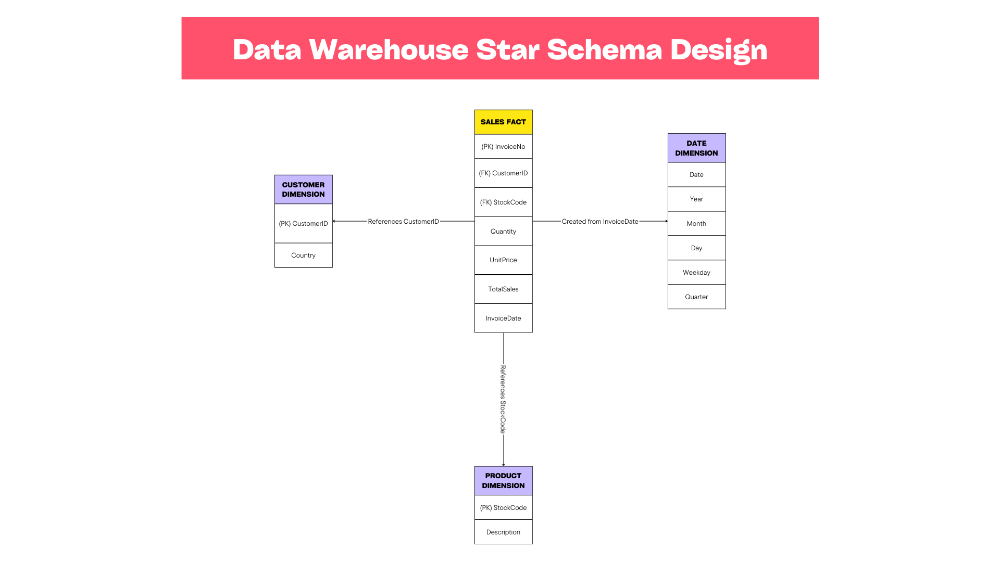

#### Efficacy of Star Schema over Snowflake

A star schema is preffered in a data warehouse since it is simple and denormalized. This means that to analyse data few joins are needed translating to fast query speeds. This means that since data warehousing focuses on OLAP queries and reporting a star schema is the most suitable schema.

### ETL Process Implementation

The relevant notebook for the ETL is [ETL Retail](./data_warehousing/etl/etl_retail.ipynb).

#### Customer Dimension Table

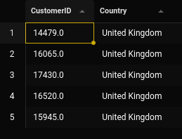


#### Product Dimension Table

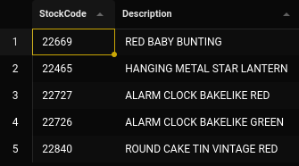


#### Date Dimension Table

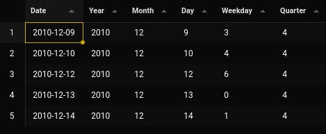


#### Sales Fact Table

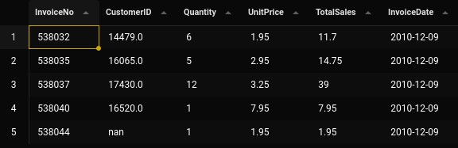


These images have their corresponding `.csv` files for viewing in a spreadsheet.

### OLAP Queries and Analysis

The relevant notebook for the OLAP visuals is [OLAP Visualisation](./data_warehousing/olap/olap_visualisation.ipynb).

To run this notebook one must have chrome already preinstalled. Chrome enables `plotly` and `kaleido` to save visualisations. Failure to have this dependency will lead to errors.

The report for the OLAP queries and analysis is [OLAP Report](./data_warehousing/olap/report.md)

## Data Mining

### Data Preprocessing and Exploration

The relevant notebook for the Iris Preprocessing is [Preprocessing Iris](./data_mining/preprocessing_and_exploration/preprocessing_iris.ipynb).

The Iris dataset is used.

A `MinMax` scaler and `LabelEncoder` are used to prepare this dataset for machine learning algorithms.

#### Exploration

##### Pairplot

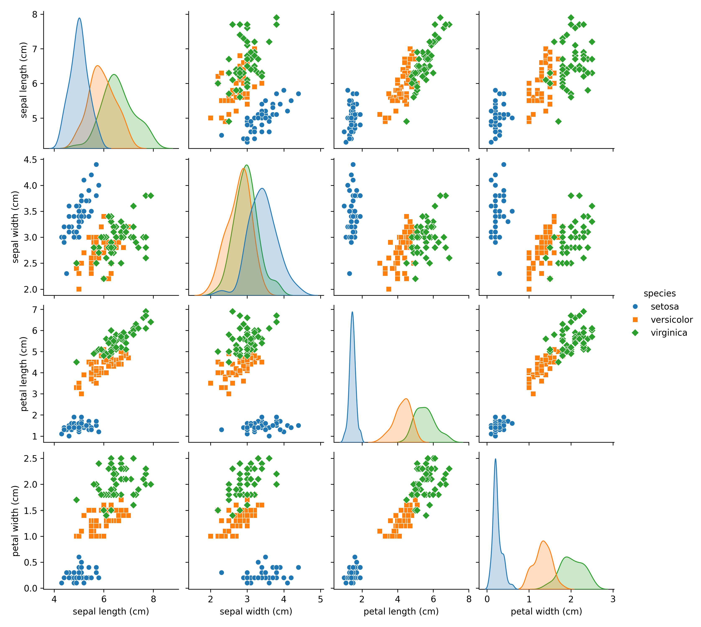

##### Correlation Heat Map

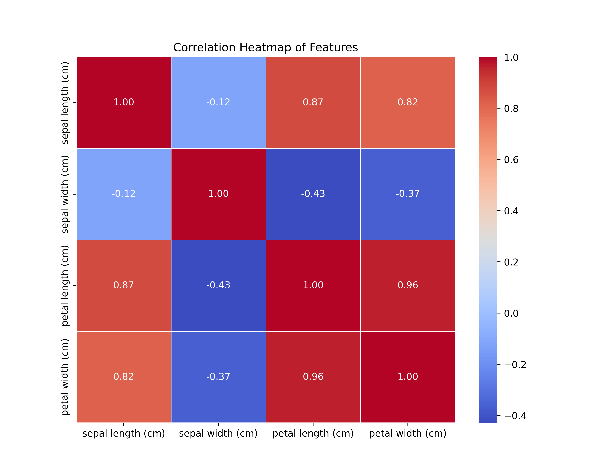

##### Boxplot

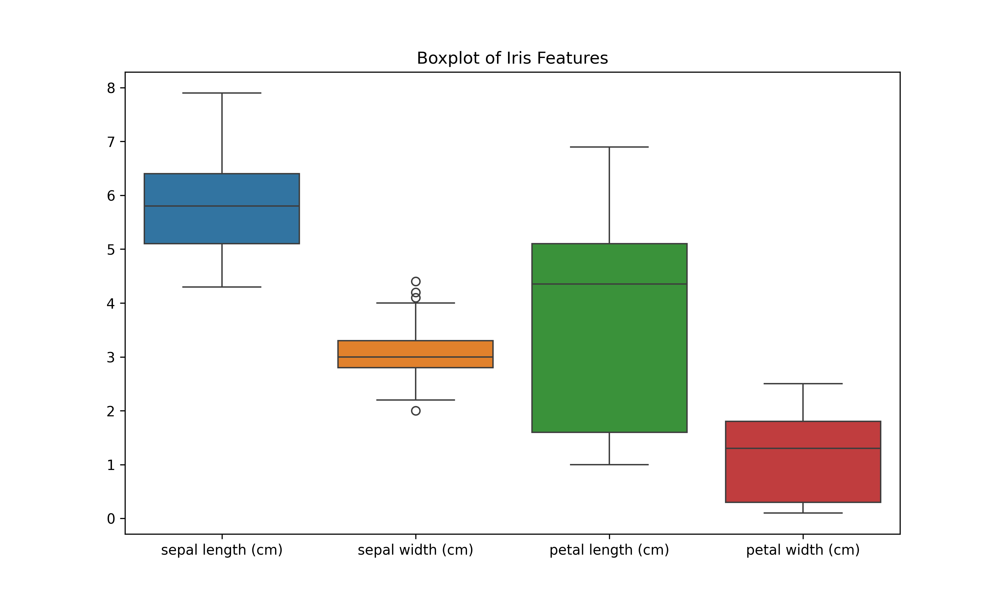

##### Analysis

The exploratory data analysis begins with a **pairplot** of the Iris dataset, which displays both individual feature distributions and pairwise scatter plots for sepal length, sepal width, petal length, and petal width across the three species. On the diagonal, sepal length distributions show slight intersection between species, while sepal width distributions overlap heavily. Petal length and petal width clearly separate *setosa* from *versicolor* and *virginica*, which themselves overlap slightly. The scatter plots reinforce this, showing that species form tight, distinct clusters, with the clearest separations involving petal measurements — suggesting these are the most discriminative features for classification.

The **correlation heatmap** quantifies these relationships, showing perfect self-correlation along the diagonal and strong positive correlations between petal length and petal width (0.96), petal length and sepal length (0.87), and petal width and sepal length (0.82). These strong associations indicate potential redundancy in the feature set. Conversely, correlations involving sepal width are weakly negative (-0.12, -0.37, -0.43), indicating minimal linear relationships with other features.

A **box plot** further illustrates distribution patterns and outliers. Sepal width is the only attribute showing outliers, pointing to occasional extreme measurements. Sepal length’s median lies centrally within its box, indicating a roughly symmetric distribution, while petal length and petal width have medians positioned near the upper edge, reflecting a slight skew toward lower values. This view provides an additional check on data quality and distribution shape, informing potential preprocessing steps before model development.

### Clustering

The relevant notebook for the Iris Clustering is [Clustering Iris](./data_mining/clustering/clustering_iris.ipynb).

#### K-Means Cluster

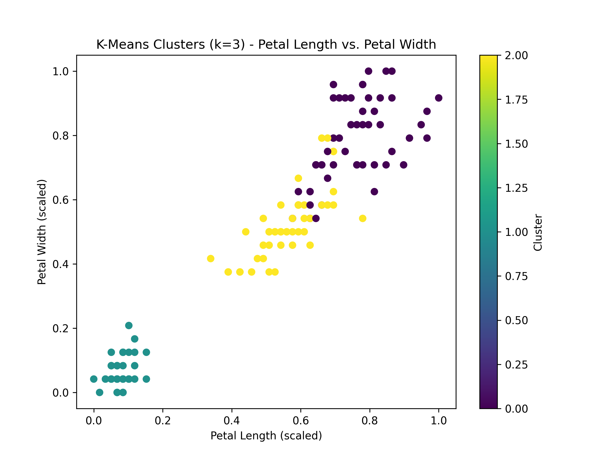

#### K-Means Elbow Curve

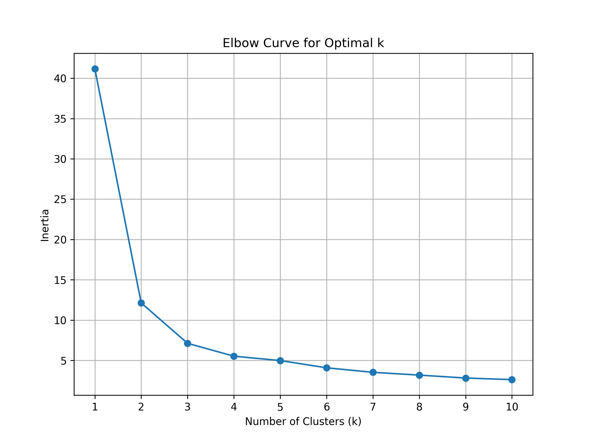

#### Analysis

The K-Means clustering analysis on the Iris dataset began with an initial choice of $k=3$, matching the known number of species. This configuration achieved an Adjusted Rand Index (ARI) of 0.701, indicating substantial alignment between the clustering results and the true species labels.

To explore the optimal number of clusters, an elbow curve was generated by plotting inertia values for $k$ ranging from 1 to 10. The curve showed a steep drop in inertia from $k=1 (≈42)$ to $k=2 (≈13)$, and then to $k=3 (≈7)$. Beyond $k=3$, the decline in inertia became gradual, reaching $≈2.5$ at $k=10$. This pattern suggests diminishing returns in variance reduction after three clusters, supporting $k=3$ as a reasonable choice.

A scatter plot of petal length versus petal width for $k=3$ revealed three distinct cluster groupings in the scaled feature space. Two of the clusters appeared close together, with slight overlap, while the third cluster was entirely separate from the others. This reflects the underlying structure of the dataset, where setosa forms a clearly distinguishable group, while versicolor and virginica share overlapping feature ranges.

These findings confirm that $k=3$ not only aligns with the dataset’s biological classification but also yields well-separated clusters for at least one species, while revealing partial overlap between the others.

The insights gained from K-Means clustering on the Iris dataset illustrate how unsupervised learning can uncover natural groupings in data without prior labels. In real-world contexts, this approach can be applied to anomaly detection, such as identifying unusual network activity in cybersecurity; and biological research, for classifying new plant or animal species based on morphological or genetic measurements.

### Classification and Association Rule Mining

The relevant notebook for the Classification and Association Rules is [Mining Iris Basket](./data_mining/classification_and_association_rules/mining_iris_basket.ipynb).

#### Classification

The decision tree is:

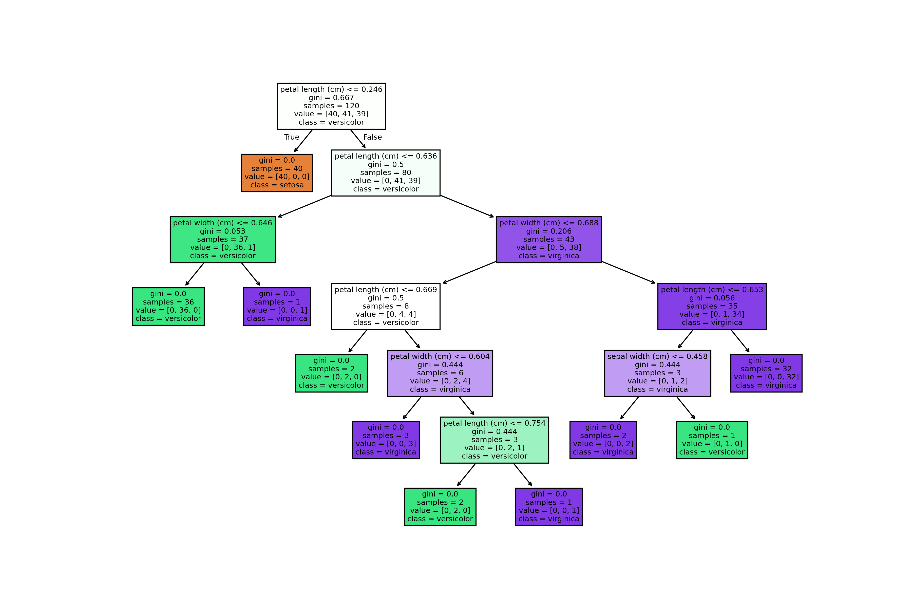

It is found that both KNN with k=5 and the decision tree perform with the same efficacy having perfect scores for every value in the testing set.

##### Analysis

Both the Decision Tree Classifier and the K-Nearest Neighbours (KNN, $k=5$) models achieved perfect accuracy on the Iris dataset. This outcome reflects the dataset’s high degree of feature separability, particularly in petal measurements, which serve as strong predictors of species. The relatively small size and balanced nature of the dataset, combined with its lack of noise, create ideal conditions for these algorithms to perform optimally. Decision Trees excel at learning clear, rule-based splits from well-structured data, while KNN benefits from the tight clustering of samples within species. While perfect scores demonstrate the models’ ability to capture the dataset’s underlying structure, they also highlight a limitation: performance on real-world, noisier datasets may not be as high. Therefore, such results should be interpreted as a benchmark of algorithm capability under ideal conditions rather than an expectation for more complex applications.

#### Association Rule Mining

Synthetic data was generated with a seed of `123`.

The frequent itemsets are obtained and the association rules mapped out. The analysis of these rules is provided in the notebook.

##### Analysis

```
   antecedents  consequents  support  confidence      lift
0  (chocolate)       (milk)      0.2    0.666667  3.333333
1       (milk)  (chocolate)      0.2    1.000000  3.333333
```

The association rules derived from the synthetic dataset (`seed = 123`) show a strong relationship between the purchase of *chocolate* and *milk*. The first rule — “chocolate → milk” — has a **support** of 0.2, meaning that 20% of all transactions contain both chocolate and milk. Its **confidence** is approximately 0.67, indicating that when chocolate is purchased, milk is also purchased about two-thirds of the time. The **lift** of 3.33 means that the likelihood of buying milk increases by more than three times when chocolate is purchased, compared to milk’s baseline purchase rate.

The second rule — “milk → chocolate” — also has 20% **support** but with 100% **confidence**, meaning that in this dataset, every transaction containing milk also contains chocolate. The **lift** remains 3.33, reinforcing the strong positive association.

While these patterns suggest a close link between the two products, it’s important to note that the data here is *synthetic*, so the relationships may not reflect real-world consumer behaviour. In practice, such rules could be used for **cross-promotions** (e.g., bundling chocolate and milk), targeted marketing, or store layout optimisation to increase sales of related items.

