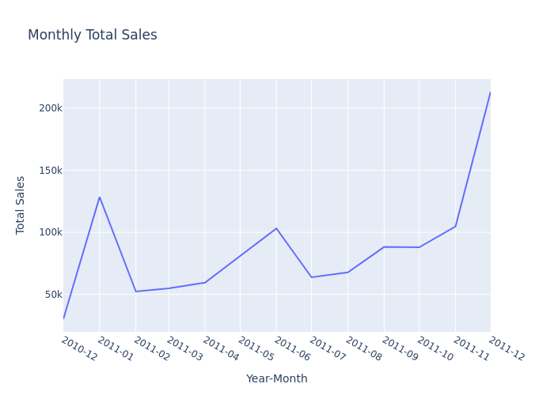
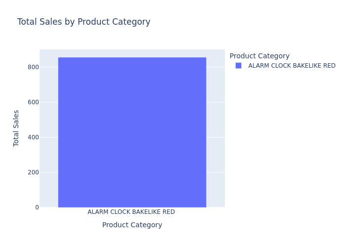

# OLAP Report

## Insights
### Top Selling Countries 

The quarterly sales comparison across the top five countries shows a consistent ranking pattern, with the United Kingdom leading by a notable margin each quarter. Portugal follows as a strong second, while Ireland, France, and Germany maintain closely grouped sales figures in the third to fifth positions. The absence of ranking shifts over the observed periods suggests a stable customer base and steady market performance across regions. This consistency indicates predictable demand patterns, allowing the warehouse to plan inventory allocation and distribution schedules more efficiently. By tracking these metrics each quarter, the warehouse can anticipate product flow needs, optimize storage capacity, and maintain high service levels in the most active regions.

### Monthly Insights for United Kingdom

A closer look at the United Kingdom’s monthly sales from December 2010 to December 2011 reveals a clear seasonal rhythm. Sales start at a low point in December 2010, followed by a strong increase in January. After a brief dip in February, sales climb steadily until June before experiencing a mid-year decline in July. From August onward, sales rise consistently, culminating in a sharp surge from November to December — likely driven by holiday-related demand. These fluctuations highlight the importance of anticipating seasonal peaks to ensure sufficient stock levels, staffing, and logistics capacity. By using warehouse data to track and forecast these patterns, operations teams can align inventory flow with market demand, avoiding stockouts during high-demand months and minimizing excess inventory in slower periods.

### Sales for Alarm Clock Bakelike Red

At the product level, the “Alarm Clock Bakelike Red” recorded total sales of 855.75 during the period. While this figure is modest compared to overall country-level sales, it illustrates the warehouse’s ability to drill down from macro trends to specific item performance. Such granularity enables managers to evaluate product popularity, assess stock turnover rates, and make informed purchasing decisions. Tracking this level of detail also helps identify potential cross-selling opportunities or product-specific promotions, ensuring that the warehouse supports not only large-scale distribution strategies but also targeted, item-level sales initiatives.
